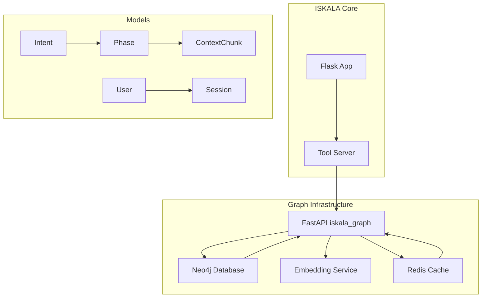

# 🚀 ISKALA MOVA Neo4j Infrastructure Setup

## 📋 Огляд

Neo4j Graph Database infrastructure для ISKALA MOVA - системи зберігання та обробки знань у вигляді графа зв'язків між намірами, фазами мислення та контекстними даними.

## 🏗️ Архітектура



## 🔧 Компоненти

### 1. Neo4j Database
- **Версія**: Neo4j 5.13 Enterprise
- **Порт**: 7687 (Bolt), 7474 (HTTP UI)  
- **База даних**: `iskala-mova`
- **Плагіни**: APOC, GDS

### 2. Redis Cache
- **Версія**: Redis 7 Alpine
- **Порт**: 6379
- **Використання**: Кешування embeddings та сесій

### 3. Python Services
- **Neo4j Driver**: Async з connection pool
- **Graph Models**: Pydantic моделі для вузлів
- **Health Check**: Моніторинг стану системи

## 🚀 Швидкий старт

### 1. Запуск Infrastructure

```bash
# Створення мережі (якщо не існує)
docker network create iskala-network

# Запуск Neo4j та Redis
docker-compose -f docker-compose.neo4j.yml up -d

# Перевірка статусу
docker ps | grep iskala
```

### 2. Встановлення Python залежностей

```bash
cd iskala_graph
pip install -r requirements.txt
```

### 3. Health Check

```bash
cd iskala_graph
python health_check.py
```

Очікуваний вивід:
```
🚀 ISKALA MOVA Neo4j Infrastructure Health Check
==================================================
🔍 Тестуємо базове підключення до Neo4j...
✅ Neo4j підключення успішне
✅ Redis підключення успішне
🔍 Тестуємо базовий запит...
✅ Базовий запит успішний: Graph ready
🔍 Створюємо індекси та constraints...
✅ Індекс створено
✅ Constraint створено
...
🎉 Всі тести пройдено успішно! Neo4j infrastructure готова до роботи.
```

## 📊 Модель даних

### Вузли (Nodes)

#### Intent (Намір)
```cypher
(:Intent {
  id: "uuid",
  name: "string",
  description: "string", 
  confidence: float,
  lang: "uk",
  category: "string",
  frequency: int,
  success_rate: float,
  created_at: datetime,
  updated_at: datetime
})
```

#### Phase (Фаза мислення)
```cypher
(:Phase {
  id: "uuid",
  name: "string",
  order: int,
  description: "string",
  input_schema: {},
  output_schema: {},
  timeout_seconds: int,
  created_at: datetime,
  updated_at: datetime
})
```

#### ContextChunk (Контекстний фрагмент)
```cypher
(:ContextChunk {
  id: "uuid",
  content: "string",
  source: "string", 
  chunk_hash: "string",
  embedding: [float],
  keywords: [string],
  language: "uk",
  metadata: {},
  usage_count: int,
  created_at: datetime,
  updated_at: datetime
})
```

### Зв'язки (Relationships)

- `(:Intent)-[:LEADS_TO]->(:Intent)` - Послідовність намірів
- `(:Phase)-[:LEADS_TO]->(:Phase)` - Послідовність фаз
- `(:Intent)-[:REFERENCES]->(:ContextChunk)` - Зв'язок з контекстом
- `(:User)-[:HAS_SESSION]->(:Session)` - Сесії користувача
- `(:Session)-[:CONTAINS]->(:Intent)` - Наміри в сесії

## 🔍 Основні запити

### Створення наміру
```python
from iskala_graph import get_neo4j_connection, Intent

conn = await get_neo4j_connection()
intent = Intent(
    name="допомога_з_кодуванням",
    description="Користувач потребує допомоги з програмуванням",
    confidence=0.9,
    category="programming"
)

result = await conn.execute_query(
    """
    MERGE (i:Intent {name: $name, lang: $lang})
    ON CREATE SET i += $props
    RETURN i
    """,
    intent.to_cypher_params()
)
```

### Пошук подібного контексту
```python
# Vector similarity search
embedding = await get_embedding("допоможи з Python кодом")

result = await conn.execute_query(
    """
    CALL db.index.vector.queryNodes('chunk_embedding_idx', 5, $embedding)
    YIELD node as chunk, score
    RETURN chunk.content, score
    ORDER BY score DESC
    """,
    {"embedding": embedding}
)
```

### Аналіз дерева намірів
```python
from iskala_graph.services.graph_models import GraphQueryBuilder

query = GraphQueryBuilder.create_intent_tree_query("допомога_з_кодуванням")
result = await conn.execute_query(query, {"root_intent": "допомога_з_кодуванням"})
```

## ⚙️ Конфігурація

### Environment Variables

```bash
# Neo4j
NEO4J_URI=bolt://localhost:7687
NEO4J_USERNAME=neo4j
NEO4J_PASSWORD=iskala-neo4j-2024-secure
NEO4J_DATABASE=iskala-mova

# Redis  
REDIS_HOST=localhost
REDIS_PORT=6379
REDIS_PASSWORD=iskala-redis-2024
```

### Docker Compose Override

Для production створіть `docker-compose.override.yml`:

```yaml
version: '3.8'
services:
  neo4j:
    environment:
      - NEO4J_dbms_memory_heap_max__size=4G
      - NEO4J_dbms_memory_pagecache_size=2G
    volumes:
      - /data/neo4j:/data  # Persistent storage
  
  redis:
    command: redis-server --requirepass ${REDIS_PASSWORD} --appendonly yes --maxmemory 1gb
```

## 🔐 Безпека

### 1. Network Security
- Neo4j доступний тільки в приватній мережі `iskala-network`
- Використання credentials через environment variables
- TLS encryption для продукційного середовища

### 2. Authentication
```python
# OAuth2 proxy для API доступу (майбутня версія)
from fastapi import Depends, HTTPException
from fastapi.security import HTTPBearer

security = HTTPBearer()

async def verify_token(token: str = Depends(security)):
    # JWT verification logic
    pass
```

## 📈 Моніторинг

### Health Check Endpoints
```python
# Автоматичний health check
GET /health -> {
  "neo4j": true,
  "redis": true, 
  "timestamp": "2024-01-01T00:00:00Z",
  "stats": {
    "total_queries": 1234,
    "failed_queries": 5,
    "cache_hits": 890,
    "cache_misses": 344
  }
}
```

### Логування
```python
import structlog

logger = structlog.get_logger("iskala_graph")
logger.info("Query executed", query_time=0.123, cache_hit=True)
```

## 🧪 Тестування

### Unit Tests
```bash
cd iskala_graph
pytest tests/ -v
```

### Integration Tests з TestContainers
```python
from testcontainers.neo4j import Neo4jContainer

def test_neo4j_integration():
    with Neo4jContainer() as neo4j:
        # Test code here
        pass
```

### Load Testing
```bash
# Використання Apache Bench для навантажувального тестування
ab -n 1000 -c 10 http://localhost:8004/health
```

## 🚀 Розгортання

### Development
```bash
docker-compose -f docker-compose.neo4j.yml up -d
```

### Production
```bash
# З persistent volumes та зовнішніми secrets
docker-compose -f docker-compose.neo4j.yml -f docker-compose.prod.yml up -d
```

### Cloud (Neo4j AuraDB)
```python
config = Neo4jConfig(
    uri="neo4j+s://xxx.databases.neo4j.io",
    username="neo4j",
    password="your_aura_password",
    encrypted=True,
    trust="TRUST_SYSTEM_CA_SIGNED_CERTIFICATES"
)
```

## 🔧 Troubleshooting

### Проблема: "Connection refused"
```bash
# Перевірити статус контейнерів
docker ps
docker logs iskala-neo4j

# Перевірити мережу
docker network ls
docker network inspect iskala-network
```

### Проблема: "Memory errors"
```bash
# Збільшити memory limits в docker-compose.yml
NEO4J_dbms_memory_heap_max__size=4G
NEO4J_dbms_memory_pagecache_size=2G
```

### Проблема: Повільні запити
```bash
# Перевірити індекси в Neo4j Browser
SHOW INDEXES
SHOW CONSTRAINTS

# Профілювання запитів
PROFILE MATCH (n:Intent) RETURN count(n)
```

## 📚 Корисні посилання

- [Neo4j Documentation](https://neo4j.com/docs/)
- [Neo4j Python Driver](https://neo4j.com/docs/python-manual/current/)
- [Cypher Query Language](https://neo4j.com/docs/cypher-manual/current/)
- [APOC Library](https://neo4j.com/docs/apoc/current/)
- [Graph Data Science](https://neo4j.com/docs/graph-data-science/current/)

---

**Статус**: ✅ Ready for Development  
**Версія**: 0.1.0  
**Останнє оновлення**: 2024-01-01 