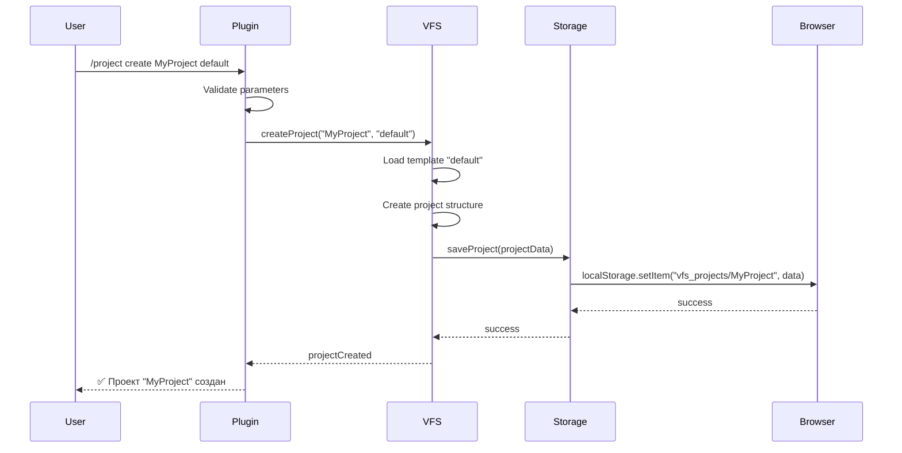
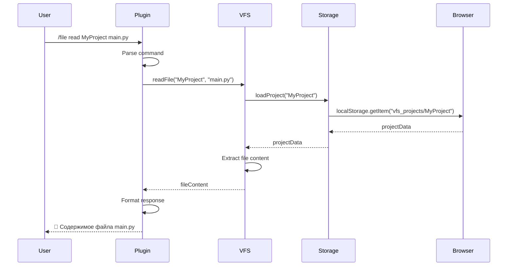
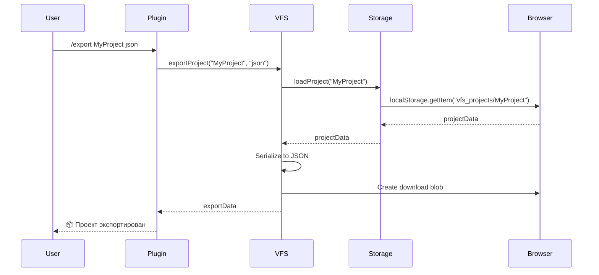

# 🏗️ Архитектура и структура ВФС

**Техническая документация виртуальной файловой системы для Open Web UI**  
*Версия: 1.0.0 | Обновлено: 2024-08-03*

---

## 🎯 Общая архитектура системы

### 📋 Компонентная схема
```
┌─────────────────────────────────────────────────────────────┐
│                    Open Web UI Frontend                     │
│  ┌───────────────────────────────────────────────────────┐  │
│  │                     Chat Interface                    │  │
│  │  ┌─────────────────────────────────────────────────┐  │  │
│  │  │            ВФС Command Parser                   │  │  │
│  │  │     /vfs, /project, /file, /template            │  │  │
│  │  └─────────────────────────────────────────────────┘  │  │
│  └───────────────────────────────────────────────────────┘  │
│                            │                                │
│  ┌───────────────────────────────────────────────────────┐  │
│  │                 VFS Plugin Layer                     │  │
│  │                                                       │  │
│  │  ┌─────────────────┐  ┌─────────────────────────────┐  │  │
│  │  │  VFS Plugin     │  │  Integrated VFS Core       │  │  │
│  │  │  (Commands)     │  │  (Storage & Logic)         │  │  │
│  │  └─────────────────┘  └─────────────────────────────┘  │  │
│  └───────────────────────────────────────────────────────┘  │
│                            │                                │
│  ┌───────────────────────────────────────────────────────┐  │
│  │                Storage Adapter                       │  │
│  │  ┌─────────────────┐  ┌─────────────────────────────┐  │  │
│  │  │  openWebUI      │  │  Fallback Storage          │  │  │
│  │  │  Storage API    │  │  (localStorage/Memory)     │  │  │
│  │  └─────────────────┘  └─────────────────────────────┘  │  │
│  └───────────────────────────────────────────────────────┘  │
└─────────────────────────────────────────────────────────────┘
                             │
┌─────────────────────────────────────────────────────────────┐
│                      Data Storage                           │
│  ┌─────────────────┐  ┌─────────────────────────────────┐  │
│  │   Browser       │  │          Server Side            │  │
│  │   localStorage  │  │     (if Storage API exists)     │  │
│  │                 │  │                                 │  │
│  │ vfs_projects/   │  │  /app/backend/data/vfs/         │  │
│  │ vfs_meta/       │  │  ├── projects/                  │  │
│  │ vfs_system_     │  │  ├── templates/                 │  │
│  │     state       │  │  └── cache/                     │  │
│  └─────────────────┘  └─────────────────────────────────┘  │
└─────────────────────────────────────────────────────────────┘
```

---

## 🧩 Основные компоненты

### 1. **VFS Plugin (`openwebui_vfs_plugin.js`)**
**Назначение**: Командный интерфейс для интеграции с Open Web UI

```javascript
class VFSPlugin {
    constructor() {
        this.name = 'Virtual File System';
        this.version = '1.0.0';
        this.vfs = null;
        this.commands = {
            '/vfs': this.handleVFSCommand,
            '/project': this.handleProjectCommand,
            '/file': this.handleFileCommand,
            '/template': this.handleTemplateCommand,
            '/export': this.handleExportCommand,
            '/import': this.handleImportCommand
        };
    }
}
```

**Ключевые функции:**
- Регистрация команд в Open Web UI
- Парсинг пользовательского ввода
- Валидация параметров команд
- Форматирование ответов
- Обработка ошибок

### 2. **Integrated VFS Core (`openwebui_integrated_vfs.js`)**
**Назначение**: Основная логика виртуальной файловой системы

```javascript
class IntegratedVFS {
    constructor() {
        this.storage = new OpenWebUIStorageAdapter();
        this.activeProject = null;
        this.templates = this._initTemplates();
        this.settings = this._initSettings();
    }
}
```

**Ключевые классы:**
- `IntegratedVFS` - главный контроллер
- `Project` - модель проекта
- `File` - модель файла
- `Directory` - модель директории (виртуальная)

### 3. **Storage Adapter**
**Назначение**: Адаптер для работы с различными хранилищами данных

```javascript
class OpenWebUIStorageAdapter {
    constructor() {
        this.storage = typeof openWebUI !== 'undefined' 
            ? openWebUI.storage 
            : this.fallbackStorage();
        this.prefix = 'vfs_projects/';
        this.metaPrefix = 'vfs_meta/';
    }
    
    fallbackStorage() {
        return {
            items: new Map(),
            async setItem(key, value) {
                this.items.set(key, JSON.stringify(value));
                // Для постоянного хранения используется localStorage
                localStorage.setItem(key, JSON.stringify(value));
            }
        };
    }
}
```

---

## 📊 Структуры данных

### Project Data Structure
```json
{
  "name": "InstagramParser",
  "type": "python",
  "template": "instagram_parser",
  "created": 1690992000000,
  "modified": 1690995600000,
  "files": {
    "instagram_parser.py": "import requests\n# код парсера...",
    "config.json": "{\"target\": \"user123\"}",
    "requirements.txt": "requests>=2.28.0\nbeautifulsoup4>=4.11.0"
  },
  "settings": {
    "pythonVersion": "3.9",
    "packages": ["requests", "beautifulsoup4"],
    "autoSave": true
  },
  "metadata": {
    "description": "Парсер Instagram профилей",
    "tags": ["parser", "instagram", "automation"],
    "author": "VFS User"
  }
}
```

### System State Structure
```json
{
  "version": "1.0.0",
  "savedAt": 1690995600000,
  "activeProject": "InstagramParser",
  "projects": ["InstagramParser", "WeatherAPI", "ProjectDocs"],
  "settings": {
    "ui": {
      "theme": "dark",
      "fontSize": 14
    },
    "performance": {
      "cacheEnabled": true,
      "cacheSize": "50MB"
    }
  },
  "statistics": {
    "totalProjects": 3,
    "totalFiles": 12,
    "totalSize": 45678,
    "lastActive": 1690995600000
  }
}
```

### Template Structure
```json
{
  "instagram_parser": {
    "name": "Instagram Parser",
    "description": "Шаблон для парсинга Instagram",
    "type": "python",
    "files": {
      "instagram_parser.py": "# Template content...",
      "config.json": "# Template config...",
      "requirements.txt": "# Template dependencies..."
    },
    "settings": {
      "pythonVersion": "3.9",
      "packages": ["requests", "beautifulsoup4", "selenium"],
      "autoSave": true
    }
  }
}
```

---

## 🔄 Потоки данных

### 1. **Создание проекта**


### 2. **Чтение файла**


### 3. **Экспорт проекта**


---

## 🔧 API интерфейсы

### Command Interface
```typescript
interface VFSCommand {
    command: string;           // Название команды (/project, /file, etc.)
    action: string;            // Действие (create, read, update, delete)
    parameters: string[];      // Параметры команды
    context?: any;            // Дополнительный контекст
}

interface VFSResponse {
    success: boolean;          // Статус выполнения
    data?: any;               // Данные ответа
    message?: string;         // Сообщение пользователю
    error?: string;           // Описание ошибки
}
```

### Storage Interface
```typescript
interface StorageAdapter {
    // Базовые операции
    setItem(key: string, value: any): Promise<boolean>;
    getItem(key: string): Promise<any>;
    removeItem(key: string): Promise<boolean>;
    keys(prefix?: string): Promise<string[]>;
    
    // ВФС-специфичные операции
    saveProject(name: string, data: ProjectData): Promise<boolean>;
    loadProject(name: string): Promise<ProjectData>;
    deleteProject(name: string): Promise<boolean>;
    listProjects(): Promise<ProjectMeta[]>;
}
```

### Project Interface
```typescript
interface ProjectData {
    name: string;
    type: string;
    template: string;
    created: number;
    modified: number;
    files: Record<string, string>;
    settings: ProjectSettings;
    metadata?: ProjectMetadata;
}

interface ProjectSettings {
    pythonVersion?: string;
    packages?: string[];
    autoSave?: boolean;
    [key: string]: any;
}

interface ProjectMetadata {
    description?: string;
    tags?: string[];
    author?: string;
    [key: string]: any;
}
```

---

## 🔒 Безопасность и валидация

### 1. **Валидация пользовательского ввода**
```javascript
class InputValidator {
    static validateProjectName(name) {
        // Проверка имени проекта
        if (!name || name.length < 1 || name.length > 50) {
            throw new Error('Некорректное имя проекта');
        }
        
        if (!/^[a-zA-Z0-9_\-]+$/.test(name)) {
            throw new Error('Имя проекта содержит недопустимые символы');
        }
        
        return true;
    }
    
    static validateFilePath(path) {
        // Проверка пути к файлу
        if (path.includes('..') || path.includes('//')) {
            throw new Error('Недопустимый путь к файлу');
        }
        
        return true;
    }
    
    static validateFileContent(content) {
        // Проверка содержимого файла
        if (content.length > 10 * 1024 * 1024) { // 10MB
            throw new Error('Файл слишком большой');
        }
        
        return true;
    }
}
```

### 2. **Sandbox режим**
```javascript
class SecurityManager {
    constructor(config) {
        this.sandboxMode = config.sandbox_mode || true;
        this.allowedExtensions = config.allowed_extensions || ['.py', '.js', '.json', '.md'];
        this.maxFileSize = config.max_file_size || '10MB';
    }
    
    checkFileAccess(filePath) {
        if (this.sandboxMode) {
            const extension = filePath.split('.').pop();
            if (!this.allowedExtensions.includes(`.${extension}`)) {
                throw new Error(`Расширение .${extension} не разрешено`);
            }
        }
        
        return true;
    }
}
```

### 3. **Rate Limiting**
```javascript
class RateLimiter {
    constructor() {
        this.requests = new Map();
        this.limits = {
            commands_per_minute: 60,
            projects_per_hour: 10,
            files_per_minute: 30
        };
    }
    
    checkRate(userId, action) {
        const key = `${userId}:${action}`;
        const now = Date.now();
        
        if (!this.requests.has(key)) {
            this.requests.set(key, []);
        }
        
        const requests = this.requests.get(key);
        const recentRequests = requests.filter(time => now - time < 60000); // Последняя минута
        
        if (recentRequests.length >= this.limits.commands_per_minute) {
            throw new Error('Превышен лимит запросов');
        }
        
        requests.push(now);
        this.requests.set(key, requests);
        
        return true;
    }
}
```

---

## 📈 Производительность и оптимизация

### 1. **Кэширование**
```javascript
class CacheManager {
    constructor() {
        this.cache = new Map();
        this.cacheTimeout = 5 * 60 * 1000; // 5 минут
    }
    
    get(key) {
        const item = this.cache.get(key);
        if (item && Date.now() - item.timestamp < this.cacheTimeout) {
            return item.data;
        }
        
        this.cache.delete(key);
        return null;
    }
    
    set(key, data) {
        this.cache.set(key, {
            data: data,
            timestamp: Date.now()
        });
    }
    
    invalidate(pattern) {
        for (const key of this.cache.keys()) {
            if (key.includes(pattern)) {
                this.cache.delete(key);
            }
        }
    }
}
```

### 2. **Lazy Loading**
```javascript
class LazyLoader {
    constructor(vfs) {
        this.vfs = vfs;
        this.loadedProjects = new Set();
    }
    
    async loadProjectOnDemand(projectName) {
        if (this.loadedProjects.has(projectName)) {
            return this.vfs.projects[projectName];
        }
        
        const projectData = await this.vfs.storage.loadProject(projectName);
        if (projectData) {
            this.vfs.projects[projectName] = projectData;
            this.loadedProjects.add(projectName);
        }
        
        return projectData;
    }
}
```

### 3. **Компрессия данных**
```javascript
class CompressionManager {
    static compress(data) {
        // Простая сжатие через gzip в браузере
        const jsonString = JSON.stringify(data);
        
        // В реальной реализации использовать pako.js или другую библиотеку
        const compressed = btoa(jsonString); // Base64 как заглушка
        
        return compressed;
    }
    
    static decompress(compressed) {
        const jsonString = atob(compressed);
        return JSON.parse(jsonString);
    }
}
```

---

## 🔍 Диагностика и отладка

### 1. **Система логирования**
```javascript
class Logger {
    constructor(level = 'INFO') {
        this.level = level;
        this.levels = {
            'DEBUG': 0,
            'INFO': 1,
            'WARN': 2,
            'ERROR': 3
        };
    }
    
    log(level, message, data = null) {
        if (this.levels[level] >= this.levels[this.level]) {
            const timestamp = new Date().toISOString();
            const logEntry = {
                timestamp,
                level,
                message,
                data
            };
            
            console.log(`[${timestamp}] ${level}: ${message}`, data || '');
            
            // Сохранение в localStorage для диагностики
            this.saveToStorage(logEntry);
        }
    }
    
    saveToStorage(entry) {
        const logs = JSON.parse(localStorage.getItem('vfs_logs') || '[]');
        logs.push(entry);
        
        // Оставляем только последние 1000 записей
        if (logs.length > 1000) {
            logs.splice(0, logs.length - 1000);
        }
        
        localStorage.setItem('vfs_logs', JSON.stringify(logs));
    }
}
```

### 2. **Health Check**
```javascript
class HealthChecker {
    static async runDiagnostics() {
        const results = {
            storage: await this.checkStorage(),
            memory: this.checkMemory(),
            performance: await this.checkPerformance(),
            data_integrity: await this.checkDataIntegrity()
        };
        
        return results;
    }
    
    static async checkStorage() {
        try {
            const testKey = 'vfs_health_test';
            const testData = { test: true, timestamp: Date.now() };
            
            localStorage.setItem(testKey, JSON.stringify(testData));
            const retrieved = JSON.parse(localStorage.getItem(testKey));
            localStorage.removeItem(testKey);
            
            return {
                status: 'OK',
                available_space: this.getStorageSize(),
                test_passed: retrieved.test === true
            };
        } catch (error) {
            return {
                status: 'ERROR',
                error: error.message
            };
        }
    }
    
    static checkMemory() {
        const used = performance.memory ? {
            used: performance.memory.usedJSHeapSize,
            total: performance.memory.totalJSHeapSize,
            limit: performance.memory.jsHeapSizeLimit
        } : { status: 'Not available' };
        
        return used;
    }
}
```

---

## 🚀 Расширения и плагины

### 1. **Plugin Architecture**
```javascript
class PluginManager {
    constructor(vfs) {
        this.vfs = vfs;
        this.plugins = new Map();
        this.hooks = new Map();
    }
    
    registerPlugin(plugin) {
        if (plugin.name && plugin.version) {
            this.plugins.set(plugin.name, plugin);
            
            // Регистрация hooks
            if (plugin.hooks) {
                for (const [event, handler] of Object.entries(plugin.hooks)) {
                    this.addHook(event, handler);
                }
            }
            
            // Инициализация плагина
            if (plugin.initialize) {
                plugin.initialize(this.vfs);
            }
            
            return true;
        }
        
        return false;
    }
    
    addHook(event, handler) {
        if (!this.hooks.has(event)) {
            this.hooks.set(event, []);
        }
        
        this.hooks.get(event).push(handler);
    }
    
    async triggerHook(event, data) {
        if (this.hooks.has(event)) {
            const handlers = this.hooks.get(event);
            
            for (const handler of handlers) {
                try {
                    await handler(data);
                } catch (error) {
                    console.error(`Hook error for ${event}:`, error);
                }
            }
        }
    }
}
```

### 2. **Custom Templates System**
```javascript
class TemplateManager {
    constructor() {
        this.templates = new Map();
        this.customTemplates = new Map();
    }
    
    registerTemplate(name, template) {
        if (this.validateTemplate(template)) {
            this.customTemplates.set(name, {
                ...template,
                custom: true,
                registered_at: Date.now()
            });
            
            return true;
        }
        
        return false;
    }
    
    validateTemplate(template) {
        const required = ['name', 'description', 'type', 'files'];
        
        for (const field of required) {
            if (!template[field]) {
                throw new Error(`Template missing required field: ${field}`);
            }
        }
        
        return true;
    }
}
```

---

## 📊 Метрики и аналитика

### 1. **Usage Analytics**
```javascript
class AnalyticsManager {
    constructor() {
        this.metrics = new Map();
        this.startTime = Date.now();
    }
    
    trackCommand(command, parameters) {
        const metric = {
            command,
            parameters: parameters.length,
            timestamp: Date.now(),
            session_id: this.getSessionId()
        };
        
        this.addMetric('commands', metric);
    }
    
    trackProjectOperation(operation, projectName, success) {
        const metric = {
            operation,
            project: projectName,
            success,
            timestamp: Date.now()
        };
        
        this.addMetric('project_operations', metric);
    }
    
    getUsageReport() {
        const report = {
            session_duration: Date.now() - this.startTime,
            total_commands: this.getMetricCount('commands'),
            total_projects: this.getMetricCount('project_operations'),
            most_used_commands: this.getMostUsedCommands(),
            error_rate: this.getErrorRate()
        };
        
        return report;
    }
}
```

---

## 🔄 Миграции и обратная совместимость

### 1. **Version Migration**
```javascript
class MigrationManager {
    constructor() {
        this.migrations = new Map();
        this.currentVersion = '1.0.0';
    }
    
    addMigration(fromVersion, toVersion, migrationFn) {
        const key = `${fromVersion}->${toVersion}`;
        this.migrations.set(key, migrationFn);
    }
    
    async migrateData(data, fromVersion, toVersion) {
        const migrationPath = this.findMigrationPath(fromVersion, toVersion);
        
        let currentData = data;
        for (const migration of migrationPath) {
            currentData = await migration(currentData);
        }
        
        return currentData;
    }
    
    findMigrationPath(from, to) {
        // Простая реализация для линейных миграций
        const migrations = [];
        const key = `${from}->${to}`;
        
        if (this.migrations.has(key)) {
            migrations.push(this.migrations.get(key));
        }
        
        return migrations;
    }
}
```

---

*Техническая документация ВФС v1.0.0*  
*© 2024 Open Web UI VFS Architecture Team* 